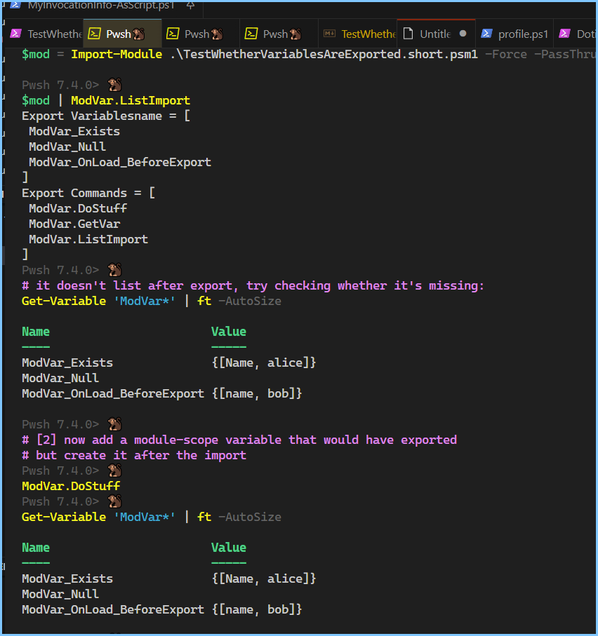

## About: 

This answers:

[1] Does the location of `Export-ModuleMember` matter when exporting variables ? Yes.
[2] Do variables created after the import, get exported, assuming they match the filters? They do not.

These results are from this test: [TestWhetherVariablesAreExported.short.psm1](./TestWhetherVariablesAreExported.short.psm1)

- [About:](#about)
- [What exports on Import?](#what-exports-on-import)
- [What exports on Import?](#what-exports-on-import-1)
  - [Phase 1: On load, before `Export-ModuleMember`](#phase-1-on-load-before-export-modulemember)
  - [Phase 2: On load, after `Export-ModuleMember`](#phase-2-on-load-after-export-modulemember)
  - [Phase 3: After load, user invokes `DoStuff()`](#phase-3-after-load-user-invokes-dostuff)



```ps1
$script:ModVar_Exists = @{ Name = 'alice' }
$script:ModVar_Null = $null

function Module.OnLoad.AfterExport {
    $script:ModVar_OnLoad_AfterExport = @{ name = 'kelly' }
}
function Module.OnLoad.BeforeExport {
    $script:ModVar_OnLoad_BeforeExport = @{ name = 'bob' }
}
function ModVar.DoStuff {
    $script:ModVar_DidStuff = @{ name = 'herbert' }
}

Module.OnLoad.BeforeExport
Export-ModuleMember -Function @('ModVar.*') -Variable @('ModVar_*')
Module.OnLoad.AfterExport
```


## What exports on Import? 

I am testing three phases

1. On load, before `Export-ModuleMember`
2. On load, after `Export-ModuleMember`
3. After load, user invokes `DoStuff()` themselves

```ps1
# [1] State from the initial import
Import-Module ./TestWhetherVariablesAreExported.psm1 -Force -PassThru
Get-Variable

# [2] Test if new variables are exported? 
ModVar.DoStuff
Get-Variable
```


## What exports on Import? 

I am testing three phases

1. On load, before `Export-ModuleMember`
2. On load, after `Export-ModuleMember`
3. After load, user invokes `DoStuff()` themselves

```ps1
# [1] State from the initial import
Import-Module ./TestWhetherVariablesAreExported.short.psm1 -Force -PassThru
Get-Variable

# [2] Test if new variables are exported? 
ModVar.DoStuff
Get-Variable
```


### Phase 1: On load, before `Export-ModuleMember`

| Name                | Exists |
| ------------------- | ------ |
| Exists              | True   |
| Null                | True   |
| OnLoad_BeforeExport | True   |
| OnLoad_AfterExport  | False  |
| DidStuff            | False  |


### Phase 2: On load, after `Export-ModuleMember`

| Name                | Exists |
| ------------------- | ------ |
| Exists              | True   |
| Null                | True   |
| OnLoad_BeforeExport | True   |
| OnLoad_AfterExport  | False  |
| DidStuff            | False  |


### Phase 3: After load, user invokes `DoStuff()`

| Name                | Exists |
| ------------------- | ------ |
| Exists              | True   |
| Null                | True   |
| OnLoad_BeforeExport | True   |
| OnLoad_AfterExport  | False  |
| DidStuff            | False  |


All three are the same. 
That's not what I expected.
I thought `OnLoad_AfterExport` would have to be exported, and `DidStuff` would not.