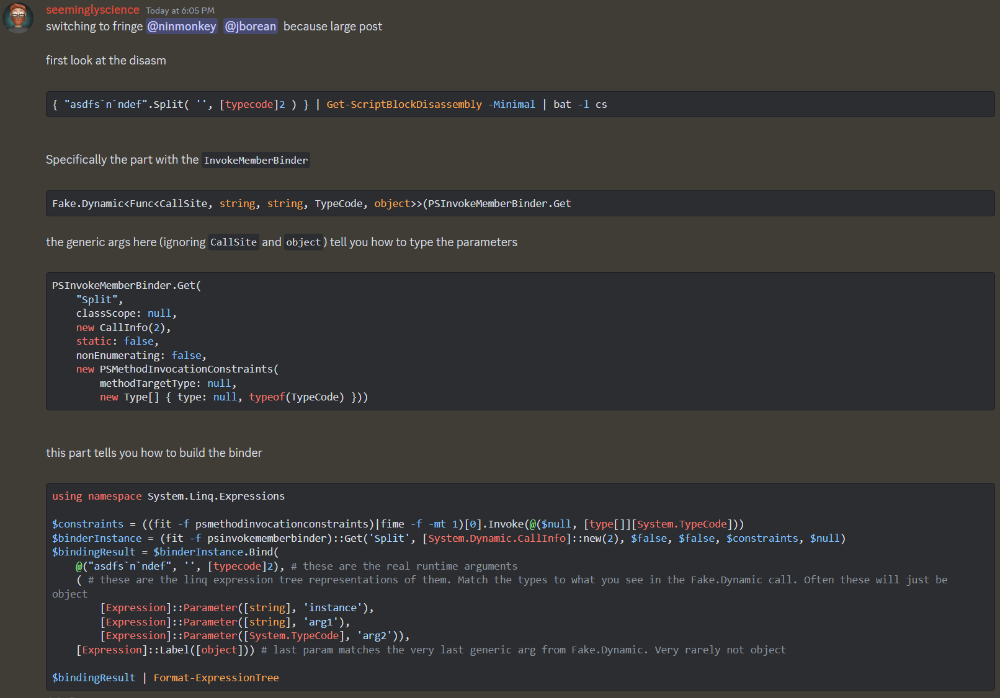

```ps1
"asdfs`n`ndef".Split( '', [typecode]2 )
```

> is there a way to see what method the overload is using? I tried their code
> I'm not sure if it's coercing 2 => [StringSplitOptions], since there'sno [typecode] parameters.
> I was looking for the same thing to compare [char[]]'' vs ''
> I tried this, but no luck. `Trace-Command -Expression {} -Name TypeConversion -PSHost -Option All`




- [discord thread: answer](https://discord.com/channels/180528040881815552/447475598911340559/1214363143992516678)
- [discord thread: question](https://discord.com/channels/180528040881815552/446156137952182282/1214359948847218690)


```ps1
# first look at the disasm
{ "asdfs`n`ndef".Split( '', [typecode]2 ) } | Get-ScriptBlockDisassembly -Minimal | bat -l cs
```

Specifically the part with the `InvokeMemberBinder`

```cs
Fake.Dynamic<Func<CallSite, string, string, TypeCode, object>>(PSInvokeMemberBinder.Get
```
the generic args here (ignoring `CallSite` and `object`) tell you how to type the parameters
```cs
PSInvokeMemberBinder.Get(
    "Split",
    classScope: null,
    new CallInfo(2),
    static: false,
    nonEnumerating: false,
    new PSMethodInvocationConstraints(
        methodTargetType: null,
        new Type[] { type: null, typeof(TypeCode) }))
```

this part tells you how to build the binder

```ps1
using namespace System.Linq.Expressions

$constraints = ((fit -f psmethodinvocationconstraints)|fime -f -mt 1)[0].Invoke(@($null, [type[]][System.TypeCode]))
$binderInstance = (fit -f psinvokememberbinder)::Get('Split', [System.Dynamic.CallInfo]::new(2), $false, $false, $constraints, $null)
$bindingResult = $binderInstance.Bind(
    @("asdfs`n`ndef", '', [typecode]2), # these are the real runtime arguments
    ( # these are the linq expression tree representations of them. Match the types to what you see in the Fake.Dynamic call. Often these will just be object
        [Expression]::Parameter([string], 'instance'),
        [Expression]::Parameter([string], 'arg1'),
        [Expression]::Parameter([System.TypeCode], 'arg2')),
    [Expression]::Label([object])) # last param matches the very last generic arg from Fake.Dynamic. Very rarely not object

$bindingResult | Format-ExpressionTree
```

> would doing it inside `&{ ... }` avoid the caching or is this outside of sbk optimisation?
> outside of it
<https://gist.github.com/SeeminglyScience/ae0abc74cfbd46e50d3912f96fce80eb> here's the binding result fyi
