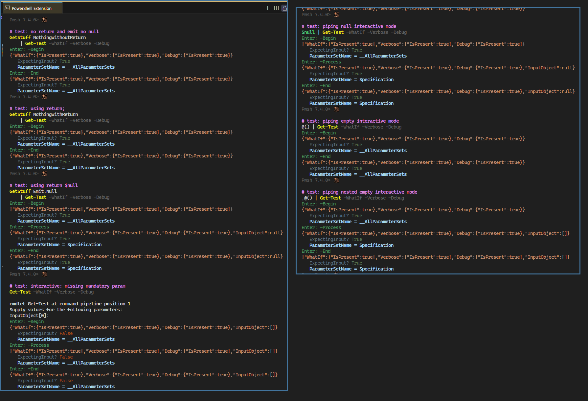
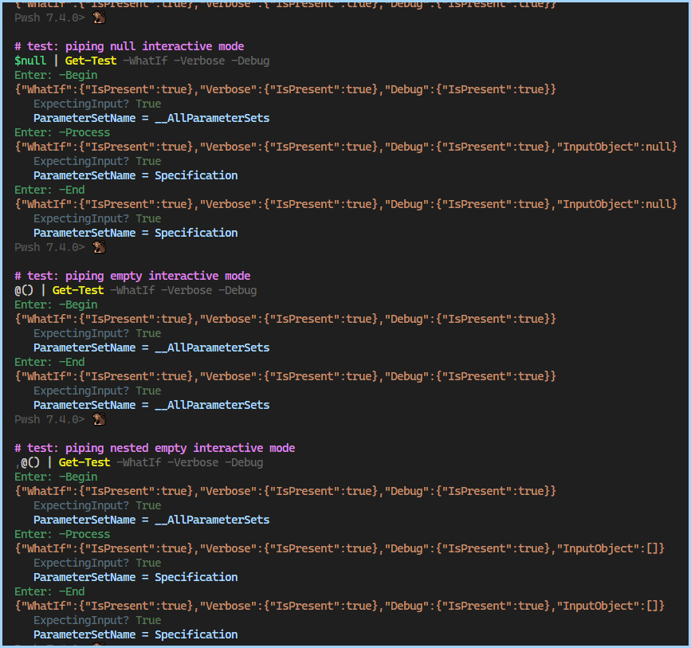
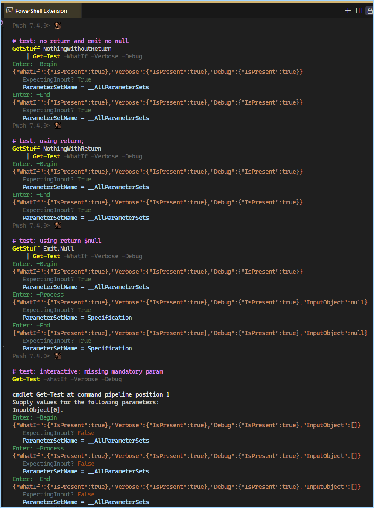

- [About](#about)
- [Individual Cases](#individual-cases)
- [As One Table](#as-one-table)
- [Screenshots](#screenshots)


### About 


Can you distinguish between different types of null values? 



There are 4 base cases tested. the 4th one is done manually because it's triggered by a missing mandatory parameter.
I experimented both with returning values, compared to similar expressions in interactive mode.

Piping `$null | ...` verses a function that emits null  `{ return $Null } | ...` or returns nothing `{ return } | ...` and without explicit return `{ } | ...`

`GetTest` and `GetStuff` are defined here: [DifferentParameterSets PipingNone vs Null.ps1](./DifferentParameterSets%20PipingNone%20vs%20Null.ps1) . Here's the abbreviated version of `GetStuff`

```ps1
function GetStuff {
    switch( $Mode) {
        'NothingWithoutReturn' {
            # no-op
        }
        'NothingWithReturn' {
            return
        }
        'Emit.Null' { 
            return $Null
        }
        default { "throw: unhandled $Mode" }
    }
}
```

ParameterSet used:

`NA` or `-` means that `block` was not invoked
`void` means does not exist, `null` means null value, `[]` means empty list

### Individual Cases

----

```ps1
Get-Test # hit enter, missing mandatory parameter
```

| Case                           | Expecting? | Block     | ParameterSetName     | InputObject |
| ------------------------------ | ---------- | --------- | -------------------- | ----------- |
| `Interactive.MissingMandatory` | false      | `begin`   | `__AllParameterSets` | `[]`        |
| `Interactive.MissingMandatory` | false      | `process` | `__AllParameterSets` | `[]`        |
| `Interactive.MissingMandatory` | false      | `end`     | `__AllParameterSets` | `[]`        |

----

```ps1
Get-Stuff Emit.Null | Get-Test
```

| Case        | Expecting? | Block     | ParameterSetName     | InputObject |
| ----------- | ---------- | --------- | -------------------- | ----------- |
| `Emit.Null` | true       | `begin`   | `__AllParameterSets` | `void`      |
| `Emit.Null` | true       | `process` | `Specification`      | `null`      |
| `Emit.Null` | true       | `end`     | `Specification`      | `null`      |

----

```ps1
Get-Stuff NothingWithoutReturn | Get-Test
```

| Case                   | Expecting? | Block   | ParameterSetName     | InputObject |
| ---------------------- | ---------- | ------- | -------------------- | ----------- |
| `NothingWithoutReturn` | true       | `begin` | `__AllParameterSets` | `void`      |
| `NothingWithoutReturn` | -          | -       | -                    | -           |
| `NothingWithoutReturn` | true       | `end`   | `__AllParameterSets` | `void`      |

----

```ps1
Get-Stuff NothingWithReturn | Get-Test
```

| Case                | Expecting? | Block   | ParameterSetName     | InputObject |
| ------------------- | ---------- | ------- | -------------------- | ----------- |
| `NothingWithReturn` | true       | `begin` | `__AllParameterSets` | -           |
| `NothingWithReturn` | -          | -       | -                    | -           |
| `NothingWithReturn` | true       | `end`   | `__AllParameterSets` | -           |


----

```ps1
$Null | Get-Test
```

| Case                   | Expecting? | Block     | ParameterSetName     | InputObject |
| ---------------------- | ---------- | --------- | -------------------- | ----------- |
| `Interactive.TrueNull` | true       | `begin`   | `__AllParameterSets` | `void`      |
| `Interactive.TrueNull` | true       | `process` | `Specification`      | `null`      |
| `Interactive.TrueNull` | true       | `end`     | `Specification`      | `null`      |


----

```ps1
@() | Get-Test
```

| Case                    | Expecting? | Block   | ParameterSetName     | InputObject |
| ----------------------- | ---------- | ------- | -------------------- | ----------- |
| `Interactive.EmptyList` | true       | `begin` | `__AllParameterSets` | `void`      |
| `Interactive.EmptyList` | true       | -       | -                    | -           |
| `Interactive.EmptyList` | true       | `end`   | `__AllParameterSets` | `void`      |

----

```ps1
,@() | Get-Test
```

| Case                        | Expecting? | Block     | ParameterSetName     | InputObject |
| --------------------------- | ---------- | --------- | -------------------- | ----------- |
| `Interactive.WrapEmptyList` | true       | `begin`   | `__AllParameterSets` | `void`      |
| `Interactive.WrapEmptyList` | true       | `process` | `Specification`      | `[]`        |
| `Interactive.WrapEmptyList` | true       | `end`     | `Specification`      | `[]`        |


### As One Table

| Case                           | Expecting? | Block     | ParameterSetName     | InputObject |
| ------------------------------ | ---------- | --------- | -------------------- | ----------- |
| `Interactive.MissingMandatory` | false      | `begin`   | `__AllParameterSets` | `[]`        |
| `Interactive.MissingMandatory` | false      | `process` | `__AllParameterSets` | `[]`        |
| `Interactive.MissingMandatory` | false      | `end`     | `__AllParameterSets` | `[]`        |
| `Emit.Null`                    | true       | `begin`   | `__AllParameterSets` | `void`      |
| `Emit.Null`                    | true       | `process` | `Specification`      | `null`      |
| `Emit.Null`                    | true       | `end`     | `Specification`      | `null`      |
| `NothingWithoutReturn`         | true       | `begin`   | `__AllParameterSets` | `void`      |
| `NothingWithoutReturn`         | -          | -         | -                    | -           |
| `NothingWithoutReturn`         | true       | `end`     | `__AllParameterSets` | `void`      |
| `NothingWithReturn`            | true       | `begin`   | `__AllParameterSets` | -           |
| `NothingWithReturn`            | -          | -         | -                    | -           |
| `NothingWithReturn`            | true       | `end`     | `__AllParameterSets` | -           |
| `Interactive.TrueNull`         | true       | `begin`   | `__AllParameterSets` | `void`      |
| `Interactive.TrueNull`         | true       | `process` | `Specification`      | `null`      |
| `Interactive.TrueNull`         | true       | `end`     | `Specification`      | `null`      |
| `Interactive.EmptyList`        | true       | `begin`   | `__AllParameterSets` | `void`      |
| `Interactive.EmptyList`        | true       | -         | -                    | -           |
| `Interactive.EmptyList`        | true       | `end`     | `__AllParameterSets` | `void`      |
| `Interactive.WrapEmptyList`    | true       | `begin`   | `__AllParameterSets` | `void`      |
| `Interactive.WrapEmptyList`    | true       | `process` | `Specification`      | `[]`        |
| `Interactive.WrapEmptyList`    | true       | `end`     | `Specification`      | `[]`        |

### Screenshots



----

