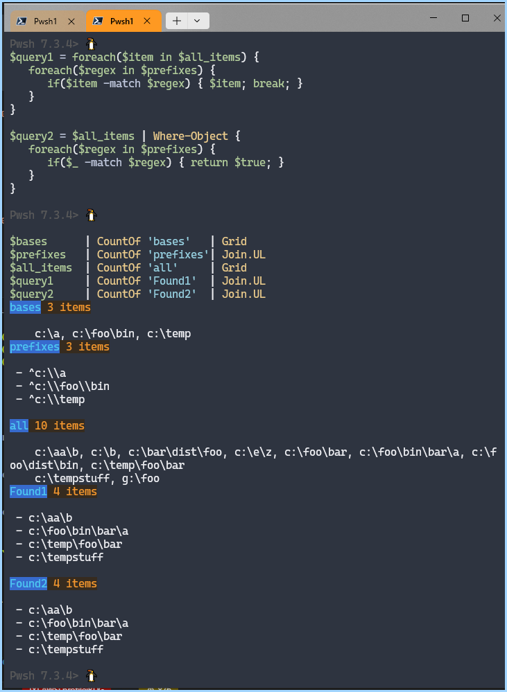

## Base 


Uses some `Pwsh` and [Nin Dotils.psm1](https://github.com/ninmonkey/dotfiles_git/blob/932ba69448835b73971be71e9a5cc35f72b31a5b/pwsh/dots_psmodules/Dotils/Dotils.psm1#L218-L374) sugar

```ps1
$bases =
    'c:\a', 'c:\foo\bin', 'c:\temp'
        | Sort-Object -Unique
        | CountOf 'Bases'

$all_items = @(
        'g:\foo', 'c:\foo\dist\bin', 'c:\b', 'c:\e\z', 'c:\aa\b'
        'c:\foo\bar', 'c:\bar\dist\foo', 'c:\temp\foo\bar',
        'c:\foo\bin\bar\a', 'c:\tempstuff'
    )
        | Sort-Object -Unique
        | CountOf 'AllItems'

$prefixes = foreach($pattern in $bases) {
    '^' + [regex]::Escape($pattern)
}
```

## Example



```ps1

# Example: Block{ Block{} }
$query1 = foreach($item in $all_items) {
   foreach($regex in $prefixes) {
      if($item -match $regex) { $item; break; }
   }
}
# Example: Function{ Block{} }
$query2 = $all_items | Where-Object {
   foreach($regex in $prefixes) {
      if($_ -match $regex) { return $true; }
   }
}
```
Note:
- `Foreach-Object` and `Where-Object` take a parameter of type [ScriptBlock]. It is not a language loop.
- `foreach(x in y)` is a **language keyword** which loops. It is not a function. 
- The easy way to tell the difference is if foreach has the word `in` in it, then it's the language keyword
- `return` exits the current `function`
- `break` and `continue` exits the current control **block**. This could be a `foreach(x in y)` or `while()` etc.  
- Another difference is `Where-Object` takes a `boolean`, without changing the object
- Verses the foreach() version, which I emit the object, else emit nothing if it doesn't match
```ps1
h1 'Example1: ...'

$bases      | CountOf 'bases'   | Grid
$prefixes   | CountOf 'prefixes'| Join.UL
$all_items  | CountOf 'all'     | Grid
$query1     | CountOf 'Found1'  | Join.UL
$query2     | CountOf 'Found2'  | Join.UL
```
<!--
h1 'Example1: -Regex: using Block{ Block{} }'


hr
$all_items | Grid
$query2     | Join.UL

h1 'Example2: -Regex: using Func{ Block{} }'

hr
$all_items | Grid
$prefixes  | Join.UL
hr
$query2     | Join.UL
-->