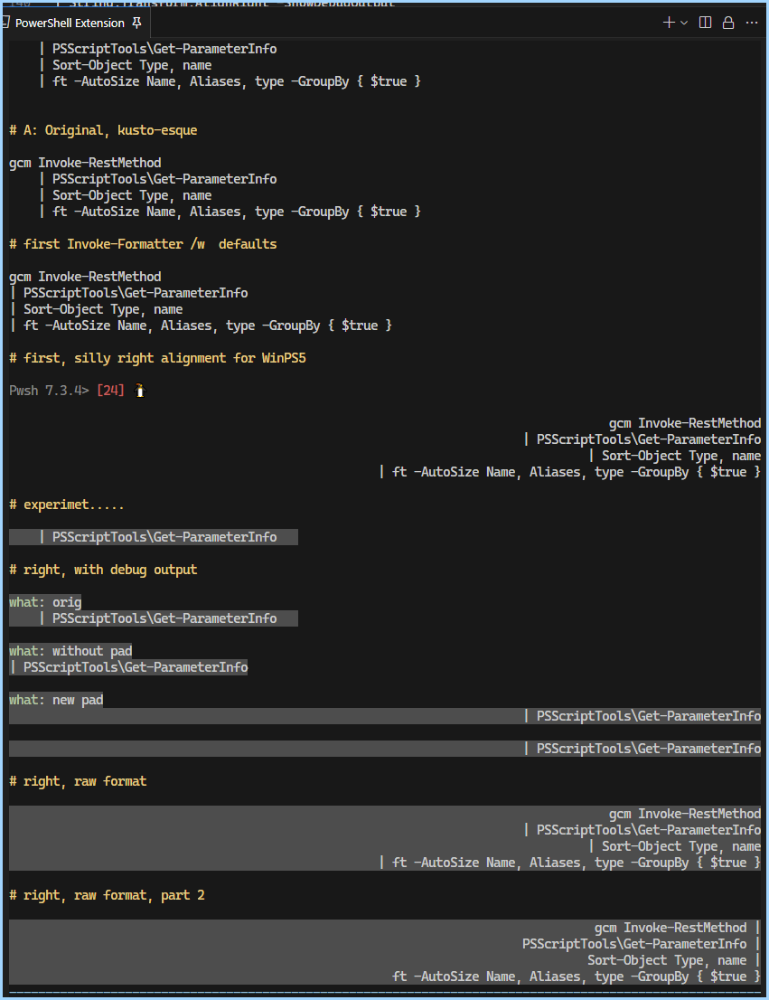

## Using a LTR language, try right-aligning using RTL 

but segments are still evaluated the same



## base case

```ps1
gcm Invoke-RestMethod |
PSScriptTools\Get-ParameterInfo |
Sort-Object Type, Name | 
ft -autoSize Name, Aliases, Type -GroupBy { $true } 
```
## base after format: RightAlign

### list of tiny alterations,  just use  test sketch
```ps1
                gcm Invoke-RestMethod             |
                PSScriptTools\Get-ParameterInfo   |
                Sort-Object Type, Name            | 
ft -autoSize Name, Aliases, Type -GroupBy { $true } 
```
#### test-n
```ps1
                gcm Invoke-RestMethod           |
                PSScriptTools\Get-ParameterInfo |
                Sort-Object Type, Name          | 
                ft -autoSize Name, Aliases, 
                    Type -GroupBy { $true } 
```
#### test-n
```ps1
                gcm Invoke-RestMethod           |
                PSScriptTools\Get-ParameterInfo |
                Sort-Object Type, Name          | 
                ft -autoSize Name, Aliases      ,
                Type -GroupBy { $true }
```
#### test-n

Style: PS5 continuations
```ps1
                | gcm Invoke-RestMethod
                | PSScriptTools\Get-ParameterInfo
                | Sort-Object Type, Name
                | ft -autoSize Name, Aliases,
                      Type -GroupBy { $true }
```
#### test-n

```ps1
                | gcm Invoke-RestMethod
                | PSScriptTools\Get-ParameterInfo
                | Sort-Object Type, Name
                | ft -autoSize Name, Aliases,
                      Type -GroupBy { $true }
```
#### test-n

```ps1
                            gcm Invoke-RestMethod   |
                    PSScriptTools\Get-ParameterInfo | 
                             Sort-Object Type, Name |
                         ft -autoSize Name, Aliases ,
                             Type -GroupBy { $true }
```
#### test-n

```ps1
                    gcm Invoke-RestMethod       |
                        PSScriptTools\Get-ParameterInfo | 
                        Sort-Object Type, Name  |
                         ft -autoSize Name, Aliases ,
                             Type -GroupBy { $true }
```

#### test-n

always fit

```ps1
gcm Invoke-RestMethod               |
    PSScriptTools\Get-ParameterInfo | 
    Sort-Object Type, Name          |
    ft -autoSize Name, Aliases ,
        Type -GroupBy { $true }
```

#### test-n

<!-- left with line -->

```ps1
gcm Invoke-RestMethod                 #|
    | PSScriptTools\Get-ParameterInfo #|
    | Sort-Object Type, Name          #|
    | ft -autoSize Name, Aliases ,    #|
        Type -GroupBy { $true }       #|
```
without

```ps1
gcm Invoke-RestMethod                 
    | PSScriptTools\Get-ParameterInfo 
    | Sort-Object Type, Name          
    | ft -autoSize Name, Aliases ,    
        Type -GroupBy { $true }       
```