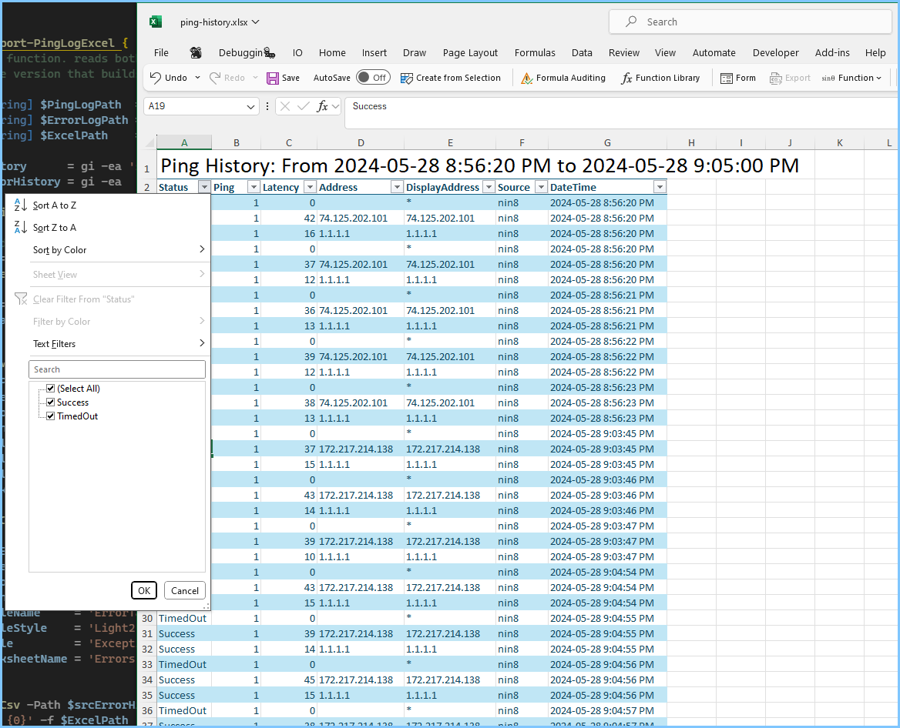

- [Ping Logger](#ping-logger)
- [Web related scripts](#web-related-scripts)
- [See More](#see-more)
  - [Rocker](#rocker)

## Ping Logger


- [Start-PingLogLoop.ps1](./Start-PingLogLoop.ps1)

## Web related scripts

- [Net.HttpListener Basics.ps1](Net.HttpListener%20Basics.ps1)
- [Net.HttpListener AsyncWait And Safe Cancelation](./Net.HttpListener%20Part2%20Async%20Cancel.ps1)


## See More

- `PipeScript\Start-PSNode`

### Rocker

- module [Rocker](https://github.com/StartAutomating/Rocker)

```ps1
# Run a script in a container
docker run mcr.microsoft.com/powershell {
    "Hello from Docker! $pid"
}
# Run an nginx container, publishing port 8080 on the host.
docker run --detach @{8080=80} nginx
```