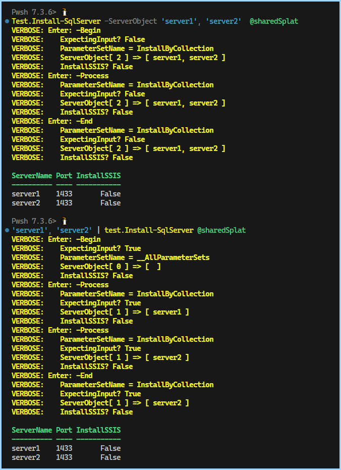

## About 


The [core question](https://discord.com/channels/180528040881815552/447522509244465152/1134622818026401802) was how do you write a function that allows you to pass as parameters or from the pipeline, like

```ps1
Install-SqlServer -ServerObject 'server1', 'server2'
'server1', 'server2' | Install-SqlServer
```

- full code: [Passing Arrays as both Parameters and ValueFromPipeline.ps1](./Passing%20Arrays%20as%20both%20Parameters%20and%20ValueFromPipeline.ps1)




- [About](#about)
- [Misc tips](#misc-tips)
- [`$InputObject` and `-Begin`](#inputobject-and--begin)
- [misc Array notes](#misc-array-notes)
- [quick note on Array types](#quick-note-on-array-types)


## Misc tips

- if a parameter like `$Port` should be valid in **both parameter sets**
- setting the right `DefaultParameterSetName`, like the from the pipline, can fix some parametersetname issues. Or at least it can make positional parameters resolve easier, meaning autocomplete easier
- if a attribute flag like `Mandatory` isn't defined, it's **false implicitly**. or use Foo = $false
  - don't set a parameterSetName so it's valid in both
- instead of `[array]` either use `@()` or `[object[]]`
- if you want a changeable array use `[List[Object]]`
- for parameters when you use `Mandatory`, it's **$true by default**
- if a parameter is a `[bool]` you want to use `[switch]` instead
- a `[switch]` parameter is **implicity false** if it's not an argument
- If you're using Pwsh, you could rewrite some of the logging
    using 'Join-String'
    and null operators like '??'

## `$InputObject` and `-Begin`

```ps1
... | Install-SqlServer
```

when passing values from the pipeline, `$ServerObject` will be `$null` when you're in the `begin {}` block, it doesn't exist yet

## misc Array notes

When using arrays, if you want to add items one at a time

```ps1
$list.AddRange( $InputList )
```
is short for

```ps1
foreach($item in $InputList) {
    $list.Add( $item )
}
```

if you include `@()` you can throw expressions in there, that can evaluate as 1-or-many items:

```ps1
$list.AddRange(@(
    Get-ChildItem -Path c:\ -depth 2  | Select -first 10  | Sort Name
))

$one = Get-Item '.' 
$list.AddRange($one)

$oneList = @( $One )
$list.AddRange( $oneList )
```

## quick note on Array types

Usually you want to use Powershell's implicit arrays, it will generate them for you.

```ps1
# or 
$files = Gci 'c:\' -depth 3
# or 
$files = foreach($file in $listOfFiles) {
    $file
}
```

If you want to append or modify the array, use `[List[Object]]` as the array. 
- Identical code runs on PS5 and PS7
- Unlike arraylist, you never have to pipe to null `$array.Add( $x ) | Out-Null` 

Otherwise usage is the same. 

Create an empty array

```ps1
using namespace System.Collections.Generic

[List[Object]]$Items = @()

# items is a 0 length collection
$Items.Add( 20 )
$Items.AddRange(@(
    30, 40 
))
#Now it's a 3 length collection
```
