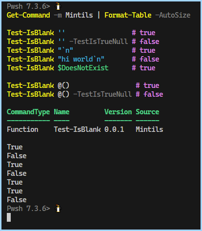

- [Final Usage](#final-usage)
- [Step1: rename your `*.ps1` to `*.psm1`](#step1-rename-your-ps1-to-psm1)
- [Step2: Generate your \*.psd1](#step2-generate-your-psd1)
- [Step3: Alternate ways to import](#step3-alternate-ways-to-import)
- [Step3: Importing](#step3-importing)
  - [1: Using the name](#1-using-the-name)
  - [2: You can use the relative path of the containing folder](#2-you-can-use-the-relative-path-of-the-containing-folder)
  - [3: Full path directly to a '.psm1'](#3-full-path-directly-to-a-psm1)
- [Listing available commands](#listing-available-commands)


## Final Usage 

```ps1
Get-Command -m Mintils | Format-Table -AutoSize

Test-IsBlank ''                 # true
Test-IsBlank '' -TestIsTrueNull # false
Test-IsBlank "`n"               # true
Test-IsBlank "hi world`n"       # false
Test-IsBlank $DoesNotExist      # true

Test-IsBlank @()                 # true
Test-IsBlank @() -TestIsTrueNull # false
```




## Step1: rename your `*.ps1` to `*.psm1`

Save your `ps1` file as [Mintils.psm1](./Mintils/Mintils.psm1) file

## Step2: Generate your *.psd1

This [builds the manifest boilerplate](./Mintils/Mintils.psd1) for you

```ps1
$newModuleManifestSplat = @{
    Path              = './Mintils/Mintils.psd1'
    RootModule        = 'Mintils.psm1'
    Author            = 'Jake Bolton <jake.bolton.314@gmail.com>'
    Copyright         = '2023'
    ModuleVersion     = '0.0.1'
    FunctionsToExport = @(
        'Test-IsBlank'
    )
    # AliasesToExport   = 'AliasA', 'AliasB'
    Description       = 'misc utility functions'
}
New-ModuleManifest @newModuleManifestSplat -PassThru
```

## Step3: Alternate ways to import

Note: `Import-Module` is **cached** by default, so if you're making any changes, use `-Force` to ensure it loads the latest version. 
If you want to load the module in your profile, the best path to use is this profile


```sh
$PROFILE.CurrentUserAllHosts
```

Because the others like `$PROFILE.CurrentUserCurrentHost` will change filepath
depending on which host you are on

side-note: `$profile` is a regular `[string]` with some properties added to it. They resolve as filepaths.

`Host` means which **shell host**, like  VSCode, windowsterminal, etc...
It does not mean host in the networking sense. 

## Step3: Importing

there are multiple ways you can import a module

### 1: Using the name

You can use the module name itself, if it's in `$Env:PSModulePath`
for the example location: `c:\Pwsh\utils\Mintils\Mintils.psm1`
You would add the parent directory  `c:\Pwsh\utils` to your `$env:PSModulePath`
```ps1
Import-Module Mintils -PassThru | Ft -auto
```

### 2: You can use the relative path of the containing folder

```ps1
Import-Module './Mintils' -Force -PassThru
```

### 3: Full path directly to a '.psm1'
```ps1
Import-Module '.\Mintils\Mintils.psm1' -Force -PassThru
```

## Listing available commands
```ps1
Get-Command -m Mintils | Format-Table -AutoSize

# output:
CommandType Name         Version Source
----------- ----         ------- ------
Function    Test-IsBlank 0.0.1   Mintils
```

